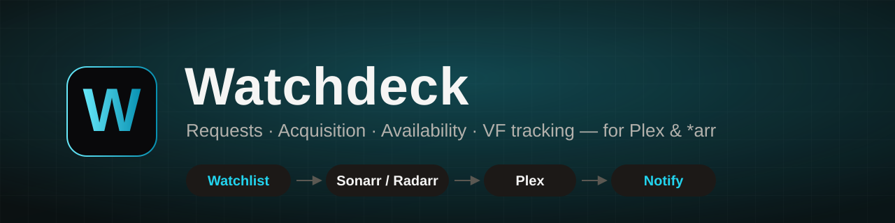
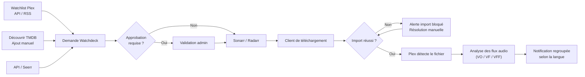
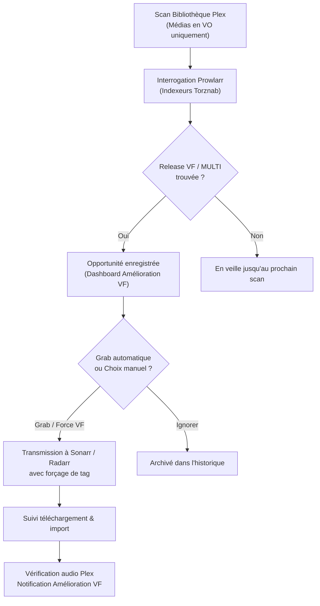
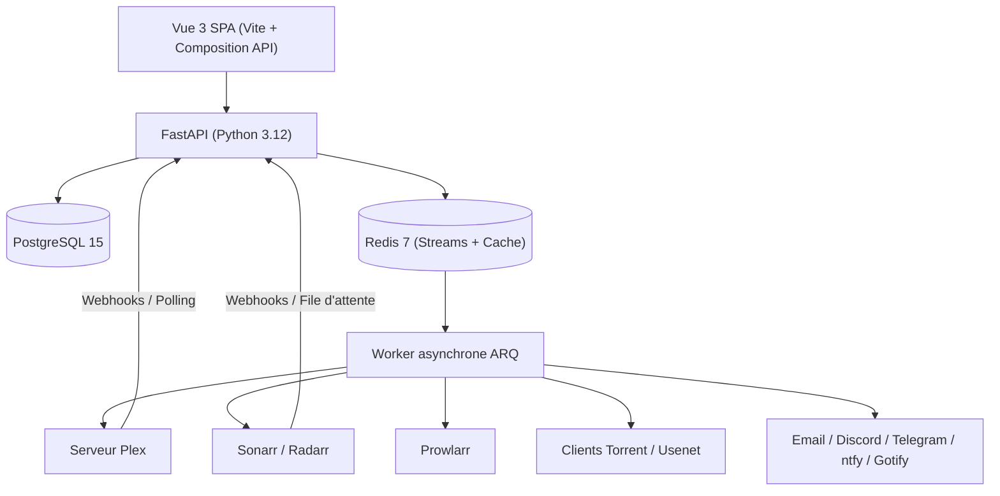
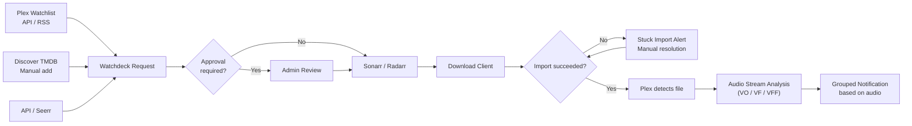
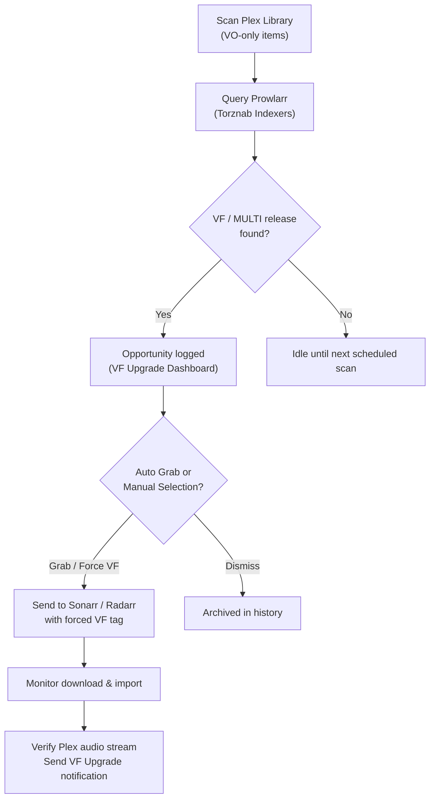
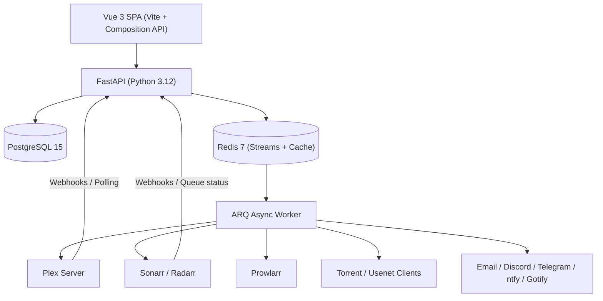

<p align="center">
  
</p>

<p align="center">
  <a href="https://github.com/remi-deher/watchdeck/actions/workflows/tests.yml"></a>
  <a href="https://github.com/remi-deher/watchdeck/actions/workflows/e2e.yml"></a>
  <a href="https://github.com/remi-deher/watchdeck/actions/workflows/docker-publish.yml"></a>
  <a href="https://hub.docker.com/r/mrcryllix/watchdeck"></a>
  <a href="LICENSE"></a>
</p>

<p align="center"><a href="#français">🇫🇷 Français</a> · <a href="#english">🇬🇧 English</a></p>

---

## Français

<p align="center">
  <strong>Watchdeck est le hub auto-hébergé tout-en-un pour Plex et l'écosystème *arr : gestion des demandes, suivi d'acquisition, détection et mise à niveau automatique vers la VF, et vérification de la disponibilité audio réelle.</strong>
</p>

### Pourquoi Watchdeck

Overseerr et Jellyseerr sont pratiques pour enregistrer une demande et la transmettre à Sonarr/Radarr. Watchdeck prend en charge ce point d'entrée, mais reste actif sur l'intégralité du cycle de vie du média :
1. **Suivi d'acquisition de bout en bout** : il surveille la file de téléchargement, détecte les blocages à l'importation et confirme la présence *réelle* du média dans Plex.
2. **Vérification audio granulaire** : il analyse les flux audio de chaque fichier (par film, saison et épisode) pour distinguer la VO, la VF, la VFF/TRUEFRENCH et la disponibilité partielle.
3. **Moteur d'amélioration VF automatique** : il scanne vos contenus encore en VO, recherche les releases VF/MULTI disponibles via Prowlarr/Torznab, permet de les grabber ou de forcer le remplacement dans Sonarr/Radarr en un clic.
4. **Notifications intelligentes** : vos utilisateurs ne sont notifiés que lorsque le fichier est réellement disponible dans Plex avec la langue attendue, et les notifications sont regroupées par saison pour éviter tout spam.

| Fonctionnalité | Watchdeck | Gestionnaire de demandes classique |
|---|---|---|
| Sources de demandes | Watchlist Plex (API + RSS), interface Découvrir, API, Overseerr/Jellyseerr | Interface, API |
| Watchlists des amis | Flux RSS Universal Watchlist (Plex Pass) — agrège les watchlists de tous vos amis sans connexion requise | Chaque utilisateur doit s'authentifier au moins une fois |
| Suivi après approbation | Téléchargement → import → disponibilité Plex → analyse des flux audio | Envoie à Sonarr/Radarr et s'arrête là |
| Détection d'import bloqué | Oui — alerte « téléchargé mais non importé » après deux vérifications consécutives | Non |
| Analyse des langues / doublages | Par film, saison et épisode : VO, VF, VFF, multilingue, couverture partielle | Non |
| Amélioration VF (Upgrades) | Scanner de fond, recherche de releases Prowlarr, grab et forçage VF intégrés | Non |
| Activité & sessions en direct | Sessions Plex en temps réel, transcodage, bande passante, carte géographique IP, Tautulli | Non ou basique |
| Notifications | Regroupées par jalon (un seul message par saison complète, pas 24 spams) | Par événement unitaire, risque de flood |
| Déploiement | Docker Compose prêt à l'emploi : API + Worker ARQ + PostgreSQL 15 + Redis 7 | Variable |

### Fonctionnalités principales

#### 1. Demandes & Orchestration
- **Multi-sources** : Watchlist Plex (API temps réel), flux RSS **Universal Watchlist** (Plex Pass), interface Découvrir (TMDB), API REST et synchronisation avec **Overseerr / Jellyseerr**.
- **Universal Watchlist (Plex Pass)** : agrège automatiquement les watchlists de tous les amis invités sur votre serveur Plex sans qu'aucun d'eux n'ait à créer de compte sur Watchdeck.
- **Routage multi-instances** : distribution intelligente vers plusieurs serveurs **Sonarr** et **Radarr** avec profils de qualité et dossiers racines configurables.
- **Granularité fine** : demande de film, série intégrale, sélection de saisons ou épisode isolé.
- **Gestion des droits** : approbation administrateur optionnelle, co-demandeurs, quotas et historique d'attribution.

#### 2. Moteur d'Amélioration VF (VF Upgrades)
- **Scanner d'opportunités** : analyse en continu les films et séries de votre bibliothèque présents uniquement en version originale (VO) pour détecter la disponibilité d'un doublage français (VF / VFF / MULTI).
- **Recherche de releases via Prowlarr** : interroge vos indexeurs Torznab configurés pour lister, filtrer et trier les releases disponibles.
- **Modale de releases enrichie** : affichage clair des métadonnées (titre épuré, taille, seeders, codec, résolution, source, score de qualité et badges de tags).
- **Remplacement forcé ou standard** : possibilité de grabber la release directement ou de forcer le tag VF dans Sonarr/Radarr si la release n'est pas nativement priorisée.
- **Tableau de bord temps réel** : filtrage avancé par statut (*À traiter*, *En cours*, *Échecs*, *Historique*) et type (*Films*, *Séries*), mise à jour instantanée via SSE.
- **Actions de maintenance** : réouverture en masse des opportunités échouées, purge d'historique et scan complet à la demande.

#### 3. Suivi des Téléchargements & Imports
- **File unifiée** : surveillance consolidée de Sonarr, Radarr et des clients directs (qBittorrent, Transmission, Deluge, SABnzbd, etc.).
- **Indicateurs opérationnels** : vitesse, progression, estimation du temps restant (ETA), client source et statut exact.
- **Détection des imports bloqués** : repérage proactif des téléchargements terminés qui ne s'importent pas dans Plex (confirmation sur deux cycles pour éliminer les faux positifs).
- **Association et import manuels** : résolution des fichiers non reconnus directement depuis l'interface.

#### 4. Analyse Audio & Disponibilité Plex
- **Inspection audio réelle** : vérification des flux audio et sous-titres des fichiers réels dans Plex (VO, VF, VFF, multilingue, pistes secondaires).
- **Suivi précis par épisode** : statut clair par saison et épisode (pas un simple indicateur global sur la série).
- **Filtres de bibliothèque** : affichage en un clic des médias complets en VF, partiels ou exclusivement en VO.
- **Fiche média complète** : timeline des statuts, détails techniques des fichiers, distribution, épisodes à venir et historique des notifications.

#### 5. Activité, Sessions en Direct & Tautulli
- **Sessions Plex en direct** : affichage des flux actifs, débit, transcodage audio/vidéo, utilisateur et appareil.
- **Géolocalisation IP** : carte interactive et localisation géographique des flux distants.
- **Intégration Tautulli** : synchronisation optionnelle de l'historique complet et des statistiques de visionnage.
- **Analytiques de bibliothèque** : statistiques de stockage, répartition des codecs, résolutions et langues.

#### 6. Notifications Intelligentes
- **Canaux multiples** : Email (SMTP), Discord (avec embeds riches), Telegram, ntfy, Gotify et Webhooks JSON.
- **Modèles personnalisables** : éditeur de templates Jinja2 avec prévisualisation et simulation par utilisateur.
- **Regroupement par jalon** : consolidation des notifications (un seul email récapitulatif pour une saison complète).
- **Événements ciblés** : nouvelle demande, média disponible, amélioration VF acquise, incident d'importation.
- **Coupe-circuit global** : bouton d'arrêt d'urgence pour suspendre les envois pendant une maintenance.

#### 7. Interface Moderne & Responsive
- **Design System soigné** : interface moderne en mode sombre, animations fluides, sidebar repliable et navigation mobile avec safe areas.
- **Mises à jour temps réel** : synchronisation automatique de l'interface via Server-Sent Events (SSE) sans rechargement de page.
- **Sécurité & Authentification** : connexion Plex OAuth SSO, support des Passkeys (WebAuthn), sessions chiffrées et conformité RGPD intégrée.

---

### Parcours d'une demande



### Cycle du moteur d'amélioration VF



---

### Architecture technique



| Composant | Rôle |
|---|---|
| `api` | API FastAPI, interface Vue 3, gestion des webhooks et flux temps réel SSE (`/api/events`) |
| `worker` | Processus ARQ pour les tâches lourdes : scans périodiques, analyse audio Plex, recherche Prowlarr, notifications |
| `db` | Base de données PostgreSQL 15 (source unique de vérité) |
| `redis` | Broker de messages Redis Streams pour le SSE, file de tâches ARQ et cache applicatif |
| `backup` / `restore` | Utilitaires de sauvegarde et restauration automatisées (profil Compose `operations`) |

#### Détail de la pile technologique

| Couche | Choix technique | Justification |
|---|---|---|
| **Backend** | Python 3.12, FastAPI, SQLAlchemy 2 (Async), Alembic | Typage strict, performances asynchrones et migrations de schéma automatisées et fiables. |
| **Worker asynchrone** | ARQ sur Redis | Isole le traitement des scans, de l'analyse audio et des notifications pour garantir une API instantanée. |
| **Frontend** | Vue 3 (Composition API), Vite, Vue Router, Vanilla CSS | SPA légère, réactive et performante, directement servie par FastAPI sans conteneur frontend séparé. |
| **Temps réel** | Server-Sent Events (SSE) adossé à Redis Streams | Synchronisation instantanée multi-onglets avec reprise transparente sur reconnexion via `Last-Event-ID`. |
| **Sécurité des secrets** | `cryptography.Fernet` (`WATCHDECK_ENCRYPTION_KEY`) | Chiffrement symétrique au repos des tokens et identifiants, clé isolée du dump de base de données. |
| **Intégrations** | `plexapi`, REST Sonarr/Radarr/Prowlarr, Webhooks | Réactivité maximale via webhooks combinée à un polling de sécurité en cas de panne réseau. |
| **Authentification** | Plex OAuth SSO, Passkeys (WebAuthn), Sessions sécurisées | Authentification sans mot de passe stocké localement, durcissement matériel possible via Passkeys. |
| **Packaging** | Docker multi-étapes (`python:3.12-alpine`) | Image minimale, sécurisée et optimisée pour la production. |

---

### Installation avec Docker

#### Prérequis
- Docker Engine 24+ ou Docker Desktop récent.
- Docker Compose v2.
- Un répertoire persistant pour les dossiers `data/` et `backups/`.

#### 1. Cloner le dépôt et préparer l'environnement
```bash
git clone https://github.com/remi-deher/watchdeck.git
cd watchdeck
cp .env.example .env
```
*Sous Windows PowerShell :*
```powershell
Copy-Item .env.example .env
```

#### 2. Générer les clés de sécurité
Définissez un mot de passe fort pour PostgreSQL dans `.env`, puis générez la clé de chiffrement Fernet :
```bash
python -c "from cryptography.fernet import Fernet; print(Fernet.generate_key().decode())"
```

Renseignez votre fichier `.env` :
```dotenv
TZ=Europe/Paris
POSTGRES_DB=watchdeck
POSTGRES_PASSWORD=votre-mot-de-passe-tres-securise
WATCHDECK_ENCRYPTION_KEY=votre-cle-fernet-generee
ARQ_MAX_JOBS=4
ARQ_JOB_TIMEOUT=3600
BACKUP_RETENTION_DAYS=14
```

> [!CAUTION]
> Conservez précieusement `WATCHDECK_ENCRYPTION_KEY`. Sa perte rendra impossible le déchiffrement des tokens enregistrés. Ne commitez jamais votre fichier `.env`.

#### 3. Démarrer les services
```bash
docker compose up -d --build
docker compose ps
```
L'application est immédiatement accessible sur [http://localhost:8000](http://localhost:8000).

Pour utiliser l'image officielle pré-construite depuis Docker Hub, remplacez `build: .` par `image: mrcryllix/watchdeck:latest` dans votre `docker-compose.yml`.

---

### Déploiement `docker-compose.yml` complet

```yaml
services:
  api:
    image: mrcryllix/watchdeck:latest
    ports: ["8000:8000"]
    volumes: ["./data:/app/data"]
    env_file: [.env]
    environment:
      DATABASE_URL: postgresql://watchdeck:${POSTGRES_PASSWORD}@db:5432/${POSTGRES_DB:-watchdeck}
      REDIS_URL: redis://redis:6379/0
      ENABLE_ARQ: "1"
      ENABLE_LEGACY_SCHEDULER: "0"
    depends_on:
      db: { condition: service_healthy }
      redis: { condition: service_healthy }
    restart: unless-stopped

  worker:
    image: mrcryllix/watchdeck:latest
    command: ["arq", "app.jobs.WorkerSettings"]
    volumes: ["./data:/app/data"]
    env_file: [.env]
    environment:
      DATABASE_URL: postgresql://watchdeck:${POSTGRES_PASSWORD}@db:5432/${POSTGRES_DB:-watchdeck}
      REDIS_URL: redis://redis:6379/0
      ENABLE_ARQ: "1"
    depends_on:
      api: { condition: service_healthy }
    restart: unless-stopped

  db:
    image: postgres:15-alpine
    environment:
      POSTGRES_USER: watchdeck
      POSTGRES_PASSWORD: ${POSTGRES_PASSWORD}
      POSTGRES_DB: ${POSTGRES_DB:-watchdeck}
    volumes: ["pgdata:/var/lib/postgresql/data"]
    healthcheck:
      test: ["CMD-SHELL", "pg_isready -U watchdeck -d ${POSTGRES_DB:-watchdeck}"]
      interval: 10s
      timeout: 5s
      retries: 5
    restart: unless-stopped

  redis:
    image: redis:7-alpine
    command: redis-server --appendonly yes
    volumes: ["redisdata:/data"]
    healthcheck:
      test: ["CMD", "redis-cli", "ping"]
      interval: 10s
      timeout: 5s
      retries: 5
    restart: unless-stopped

volumes:
  pgdata:
  redisdata:
```

---

### Premier démarrage & Configuration

1. Rendez-vous sur l'interface web et créez le compte administrateur propriétaire.
2. Dans **Paramètres → Connexions**, configurez l'accès à votre serveur **Plex**, vos instances **Sonarr / Radarr** et votre instance **Prowlarr**.
3. Dans **Paramètres → Utilisateurs**, synchronisez vos utilisateurs Plex et ajustez les permissions.
4. Dans **Paramètres → Notifications**, configurez vos canaux (Discord, Telegram, Email, etc.) et testez l'envoi.
5. Dans **Paramètres → Améliorations VF**, ajustez les intervalles de scan et vos indexeurs favoris.
6. Configurez les webhooks dans Sonarr, Radarr et Plex pour un rafraîchissement instantané :

| Source | URL Webhook Watchdeck | Événements recommandés |
|---|---|---|
| **Sonarr** | `https://watchdeck.domaine.fr/webhook/sonarr` | Grab / Download / Import / Upgrade |
| **Radarr** | `https://watchdeck.domaine.fr/webhook/radarr` | Grab / Download / Import / Upgrade |
| **Plex** | `https://watchdeck.domaine.fr/webhook/plex` | `library.new`, `media.play`, `media.stop` |

---

### Exploitation & Maintenance

#### Vérification de l'état des services
```bash
docker compose ps
docker compose logs --tail=100 api
docker compose logs --tail=100 worker
docker compose exec redis redis-cli ping
docker compose exec db pg_isready -U watchdeck -d watchdeck
```

| Point d'accès | Rôle |
|---|---|
| `/api/health` | Bilan de santé global (Plex, *arr, Base de données, Redis, Worker) |
| `/api/metrics/prometheus` | Métriques d'exploitation pour Prometheus / Grafana |
| `/api/events` | Flux Server-Sent Events authentifié |

#### Sauvegarde et Restauration
- **Créer une sauvegarde manuelle :**
  ```bash
  docker compose --profile operations run --rm backup
  ```
- **Restaurer une sauvegarde :**
  ```bash
  docker compose stop api worker
  RESTORE_FILE=watchdeck-20260814T000000Z.dump CONFIRM_RESTORE=YES \
    docker compose --profile operations run --rm restore
  docker compose up -d api worker
  ```

---

### Développement local

#### Backend
```bash
python -m venv .venv
# Linux/macOS : source .venv/bin/activate
# Windows PowerShell : .venv\Scripts\Activate.ps1
pip install -r requirements.txt -r requirements-dev.txt
alembic upgrade head
uvicorn app.main:app --reload
```

#### Frontend
```bash
cd frontend
npm ci
npm run dev
npm run test:unit
npm run build
```

---

### Sécurité & Confidentialité

- Déployez toujours Watchdeck derrière un reverse-proxy HTTPS (Traefik, Nginx, Caddy).
- Ne rendez jamais accessibles publiquement les ports directs de PostgreSQL ou Redis.
- Sauvegardez votre variable `WATCHDECK_ENCRYPTION_KEY` dans un gestionnaire de mots de passe sécurisé.
- Conformité RGPD : un modèle de registre des activités de traitement est fourni dans [docs/RGPD_REGISTRE.md](docs/RGPD_REGISTRE.md). Configurez le contact DPO/Responsable dans **Paramètres → Données & Confidentialité** (alimente automatiquement la page `/privacy`).

### Licence

[MIT](LICENSE) — Copyright © 2026 Rémi DEHER.

---

## English

<p align="center">
  <strong>Watchdeck is the all-in-one self-hosted hub for Plex and the *arr ecosystem: unified request management, acquisition tracking, automated French dub (VF) upgrades, and verified audio availability.</strong>
</p>

### Why Watchdeck

Overseerr and Jellyseerr are great intake tools for handling user requests and forwarding them to Sonarr/Radarr. Watchdeck covers that intake, but stays actively engaged throughout the entire media lifecycle:
1. **End-to-End Acquisition Tracking**: monitors the download queue, detects stuck imports, and confirms actual availability inside Plex.
2. **Granular Audio Analysis**: analyzes real audio streams per movie, season, and episode to accurately distinguish original audio (VO), French dubs (VF / VFF / TRUEFRENCH), and partial coverage.
3. **Automated VF Upgrade Engine**: continuously detects titles in your library that are still only in original language, queries Prowlarr/Torznab for available VF/MULTI releases, and allows one-click grabbing or forced replacement in Sonarr/Radarr.
4. **Smart Grouped Notifications**: users are only notified once media is truly ready in Plex with the expected audio track, with milestone grouping per season to avoid notification spam.

| Feature | Watchdeck | Traditional Request Manager |
|---|---|---|
| Intake Sources | Plex Watchlist (API + RSS), Discover UI, REST API, Overseerr/Jellyseerr | UI, API |
| Friends' Watchlists | Universal Watchlist RSS feed (Plex Pass) — tracks all friends' watchlists with zero login required | Each user must sign in at least once |
| Post-Approval Tracking | Download → import → Plex availability → audio track verification | Sends to Sonarr/Radarr and stops there |
| Stuck-Import Detection | Yes — alerts on "downloaded but never imported" after two consecutive checks | No |
| Audio / Dub Inspection | Per movie, season, and episode: VO, VF, VFF, multi-audio, partial coverage | No |
| VF Upgrade Engine | Background scanner, Prowlarr release searches, direct grab & forced VF tagging | No |
| Live Activity & Sessions | Real-time Plex streams, transcoding stats, bandwidth, IP geolocation map, Tautulli | None or basic |
| Notifications | Grouped by milestone (one message for a full season, no spam) | Per single event, risk of flooding |
| Deployment | Turnkey Docker Compose: API + ARQ Worker + PostgreSQL 15 + Redis 7 | Varies |

### Core Features

#### 1. Requests & Orchestration
- **Multiple Intake Channels**: Plex Watchlist (real-time API), **Universal Watchlist** RSS feed (Plex Pass), Discover UI (TMDB), REST API, and two-way sync with **Overseerr / Jellyseerr**.
- **Universal Watchlist (Plex Pass)**: automatically monitors watchlists for all invited Plex friends without requiring them to create a Watchdeck account.
- **Multi-Instance Routing**: intelligently routes to multiple **Sonarr** and **Radarr** instances with customizable root folders and quality profiles.
- **Granular Targeting**: request complete movies, whole series, specific seasons, or isolated episodes.
- **Access Control**: optional admin approval workflows, co-requesters, per-user quotas, and provenance tracking.

#### 2. VF Upgrade Engine (French Dub Upgrades)
- **Opportunity Scanner**: continuously inspects your Plex library for movies and TV series that are currently VO-only (original audio without French dub).
- **Prowlarr Release Search**: queries configured Torznab indexers to list, filter, and score available VF, VFF, and MULTI releases.
- **Rich Release Modal**: displays clean parsed release titles, file sizes, seeders, codecs, source resolutions, quality scores, and audio badges.
- **Standard & Forced VF Grabbing**: grab releases directly or enforce a VF tag in Sonarr/Radarr when releases are not natively prioritized by quality profiles.
- **Real-Time Upgrade Dashboard**: filter by status (*Pending*, *In Progress*, *Failed*, *History*) and media type (*Movies*, *Series*) with instant SSE updates.
- **Maintenance Actions**: bulk-reopen failed opportunities, purge history, and trigger on-demand scans.

#### 3. Download & Import Tracking
- **Unified Queue**: consolidated overview of active downloads across Sonarr, Radarr, and direct clients (qBittorrent, Transmission, Deluge, SABnzbd, etc.).
- **Operational Metrics**: download speed, progress percentage, ETA, source client, and current queue state.
- **Stuck Import Detection**: proactively identifies completed downloads that fail to import into Plex (confirmed over two cycles to prevent false positives).
- **Manual Import & Matching**: resolve unrecognized releases directly from the UI.

#### 4. Audio Analysis & Plex Availability
- **Real Media Stream Inspection**: analyzes actual audio and subtitle tracks in Plex files (VO, VF, VFF, multi-audio, secondary dubs).
- **Episode-Level Tracking**: clear visibility per season and episode rather than a generic series-level flag.
- **One-Click Library Filters**: instantly filter library items by VF availability, partial status, or VO-only.
- **Comprehensive Media Cards**: status timeline, technical file stream details, cast & crew, upcoming episodes, and notification history.

#### 5. Live Activity, Sessions & Tautulli
- **Live Plex Streams**: real-time view of active sessions, bandwidth, audio/video transcoding details, user, and player device.
- **IP Geolocation**: interactive map and geographic location of remote playback sessions.
- **Tautulli Integration**: optional synchronization of comprehensive watch history and statistics.
- **Library Analytics**: storage usage charts, video codecs, audio formats, and resolution breakdowns.

#### 6. Smart Notifications
- **Multi-Channel Delivery**: Email (SMTP), Discord (rich embeds), Telegram, ntfy, Gotify, and generic JSON Webhooks.
- **Customizable Templates**: Jinja2 template editor with live preview and per-user simulation.
- **Milestone Grouping**: consolidates notifications (e.g., a single summary for an entire season rather than 24 separate emails).
- **Targeted Triggers**: new request, approved, available in Plex, VF upgraded, and import failures.
- **Global Kill Switch**: emergency toggle to pause outgoing notifications during maintenance.

#### 7. Modern & Responsive UI
- **Refined Design System**: premium dark theme, fluid animations, collapsible sidebar, and mobile layout with safe-area support.
- **Real-Time Synchronisation**: automated UI updates via Server-Sent Events (SSE) without manual page refreshes.
- **Security & Privacy**: Plex OAuth SSO, Passkeys (WebAuthn), encrypted session tokens, and built-in GDPR compliance.

---

### Request Lifecycle



### VF Upgrade Lifecycle



---

### Technical Architecture



| Component | Role |
|---|---|
| `api` | FastAPI backend, Vue 3 SPA, webhooks handler, and real-time SSE stream (`/api/events`) |
| `worker` | Dedicated ARQ process for background workloads: library scans, audio stream inspection, Prowlarr lookups, notifications |
| `db` | PostgreSQL 15 database (primary system of record) |
| `redis` | Redis Streams broker for real-time SSE, ARQ task queue, and application caching |
| `backup` / `restore` | Automated backup and restore utilities (Compose `operations` profile) |

#### Detailed Technology Stack

| Layer | Technology | Rationale |
|---|---|---|
| **Backend** | Python 3.12, FastAPI, SQLAlchemy 2 (Async), Alembic | Strong typing, high-concurrency async performance, and reliable database schema migrations. |
| **Background Worker** | ARQ over Redis | Offloads intensive scans, audio inspections, and notifications to maintain sub-millisecond API response times. |
| **Frontend** | Vue 3 (Composition API), Vite, Vue Router, Vanilla CSS | Lightweight, high-performance SPA served directly by FastAPI without requiring a separate node container. |
| **Real-Time** | Server-Sent Events (SSE) backed by Redis Streams | Instant multi-tab UI updates with automatic resumption after reconnect via `Last-Event-ID`. |
| **Secrets Security** | `cryptography.Fernet` (`WATCHDECK_ENCRYPTION_KEY`) | Symmetric encryption at rest for third-party tokens and passwords, keeping the encryption key separate from database backups. |
| **Integrations** | `plexapi`, Sonarr/Radarr/Prowlarr REST, Webhooks | Near-instant event response via webhooks backed by polling safety nets in case of network interruptions. |
| **Authentication** | Plex OAuth SSO, Passkeys (WebAuthn), Secure Sessions | Passwordless authentication with optional hardware-backed Passkey enforcement. |
| **Packaging** | Multi-stage Docker build (`python:3.12-alpine`) | Minimal, secure, and production-optimized container image. |

---

### Installation (Docker)

#### Prerequisites
- Docker Engine 24+ or a recent Docker Desktop release.
- Docker Compose v2.
- A persistent host directory for `data/` and `backups/`.

#### 1. Clone the repository & prepare configuration
```bash
git clone https://github.com/remi-deher/watchdeck.git
cd watchdeck
cp .env.example .env
```
*On Windows PowerShell:*
```powershell
Copy-Item .env.example .env
```

#### 2. Generate security secrets
Set a strong PostgreSQL password in `.env`, then generate the Fernet encryption key:
```bash
python -c "from cryptography.fernet import Fernet; print(Fernet.generate_key().decode())"
```

Update your `.env` file:
```dotenv
TZ=Europe/Paris
POSTGRES_DB=watchdeck
POSTGRES_PASSWORD=your-secure-postgres-password
WATCHDECK_ENCRYPTION_KEY=your-generated-fernet-key
ARQ_MAX_JOBS=4
ARQ_JOB_TIMEOUT=3600
BACKUP_RETENTION_DAYS=14
```

> [!CAUTION]
> Back up `WATCHDECK_ENCRYPTION_KEY` securely. If lost, existing encrypted integration tokens cannot be decrypted. Never commit your `.env` file.

#### 3. Start the containers
```bash
docker compose up -d --build
docker compose ps
```
The application is accessible at [http://localhost:8000](http://localhost:8000).

To use the official pre-built image from Docker Hub, replace `build: .` with `image: mrcryllix/watchdeck:latest` in your `docker-compose.yml`.

---

### Complete `docker-compose.yml` Deployment

```yaml
services:
  api:
    image: mrcryllix/watchdeck:latest
    ports: ["8000:8000"]
    volumes: ["./data:/app/data"]
    env_file: [.env]
    environment:
      DATABASE_URL: postgresql://watchdeck:${POSTGRES_PASSWORD}@db:5432/${POSTGRES_DB:-watchdeck}
      REDIS_URL: redis://redis:6379/0
      ENABLE_ARQ: "1"
      ENABLE_LEGACY_SCHEDULER: "0"
    depends_on:
      db: { condition: service_healthy }
      redis: { condition: service_healthy }
    restart: unless-stopped

  worker:
    image: mrcryllix/watchdeck:latest
    command: ["arq", "app.jobs.WorkerSettings"]
    volumes: ["./data:/app/data"]
    env_file: [.env]
    environment:
      DATABASE_URL: postgresql://watchdeck:${POSTGRES_PASSWORD}@db:5432/${POSTGRES_DB:-watchdeck}
      REDIS_URL: redis://redis:6379/0
      ENABLE_ARQ: "1"
    depends_on:
      api: { condition: service_healthy }
    restart: unless-stopped

  db:
    image: postgres:15-alpine
    environment:
      POSTGRES_USER: watchdeck
      POSTGRES_PASSWORD: ${POSTGRES_PASSWORD}
      POSTGRES_DB: ${POSTGRES_DB:-watchdeck}
    volumes: ["pgdata:/var/lib/postgresql/data"]
    healthcheck:
      test: ["CMD-SHELL", "pg_isready -U watchdeck -d ${POSTGRES_DB:-watchdeck}"]
      interval: 10s
      timeout: 5s
      retries: 5
    restart: unless-stopped

  redis:
    image: redis:7-alpine
    command: redis-server --appendonly yes
    volumes: ["redisdata:/data"]
    healthcheck:
      test: ["CMD", "redis-cli", "ping"]
      interval: 10s
      timeout: 5s
      retries: 5
    restart: unless-stopped

volumes:
  pgdata:
  redisdata:
```

---

### Initial Setup & Configuration

1. Open the web interface and complete the owner account setup.
2. Under **Settings → Connections**, configure your **Plex** server, **Sonarr / Radarr** instances, and **Prowlarr** connection.
3. Under **Settings → Users**, sync Plex users and assign library permissions.
4. Under **Settings → Notifications**, configure channels (Discord, Telegram, Email, etc.) and run test deliveries.
5. Under **Settings → VF Upgrades**, adjust scan intervals and preferred Torznab indexers.
6. Configure incoming webhooks in Sonarr, Radarr, and Plex for instantaneous updates:

| Source | Watchdeck Webhook URL | Recommended Events |
|---|---|---|
| **Sonarr** | `https://watchdeck.yourdomain.com/webhook/sonarr` | Grab / Download / Import / Upgrade |
| **Radarr** | `https://watchdeck.yourdomain.com/webhook/radarr` | Grab / Download / Import / Upgrade |
| **Plex** | `https://watchdeck.yourdomain.com/webhook/plex` | `library.new`, `media.play`, `media.stop` |

---

### Operations & Maintenance

#### Health Checks
```bash
docker compose ps
docker compose logs --tail=100 api
docker compose logs --tail=100 worker
docker compose exec redis redis-cli ping
docker compose exec db pg_isready -U watchdeck -d watchdeck
```

| Endpoint | Purpose |
|---|---|
| `/api/health` | Comprehensive infrastructure and integration health status |
| `/api/metrics/prometheus` | Prometheus metrics for observability and dashboards |
| `/api/events` | Authenticated real-time SSE stream |

#### Backup & Restore
- **Create an on-demand database backup:**
  ```bash
  docker compose --profile operations run --rm backup
  ```
- **Restore a database dump:**
  ```bash
  docker compose stop api worker
  RESTORE_FILE=watchdeck-20260814T000000Z.dump CONFIRM_RESTORE=YES \
    docker compose --profile operations run --rm restore
  docker compose up -d api worker
  ```

---

### Local Development

#### Backend
```bash
python -m venv .venv
# Linux/macOS: source .venv/bin/activate
# Windows PowerShell: .venv\Scripts\Activate.ps1
pip install -r requirements.txt -r requirements-dev.txt
alembic upgrade head
uvicorn app.main:app --reload
```

#### Frontend
```bash
cd frontend
npm ci
npm run dev
npm run test:unit
npm run build
```

---

### Security & Privacy

- Always deploy Watchdeck behind an HTTPS reverse proxy (Traefik, Nginx, Caddy).
- Never expose PostgreSQL or Redis directly to the public internet.
- Store your `WATCHDECK_ENCRYPTION_KEY` in a secure password manager.
- GDPR Compliance: a processing activity register template is available in [docs/RGPD_REGISTRE.md](docs/RGPD_REGISTRE.md). Configure data controller details under **Settings → Data & Privacy** (populates the public `/privacy` page).

### License

[MIT](LICENSE) — Copyright © 2026 Rémi DEHER.
